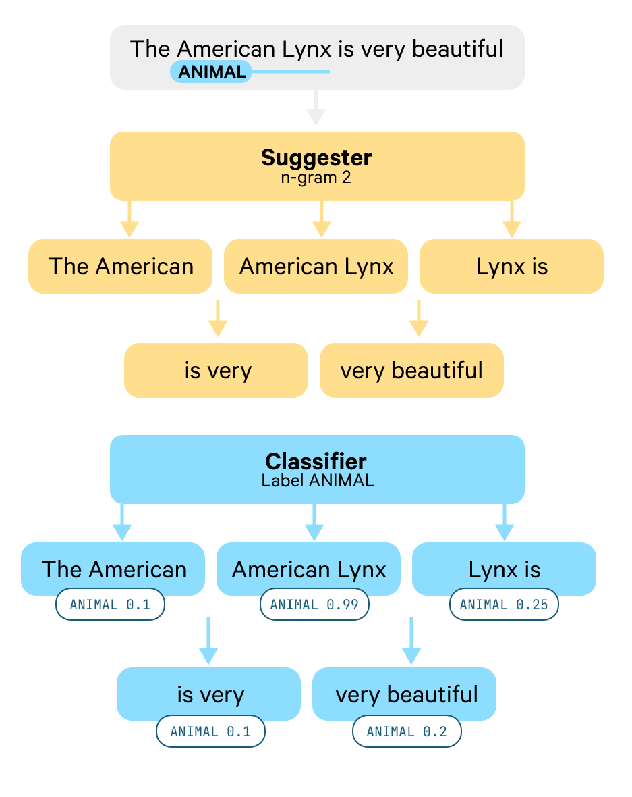

# NLP Assignment 3

**Student name**: Evgenij

**Student surname**: Ivankin

**Student e-mail**: e.ivankin@innopolis.university

**Codalab nickname**: no-more-nlp-assignments-yay

**Github**:
[https://github.com/eivankin/i-hate-nlp/tree/master/assignment_3](https://github.com/eivankin/i-hate-nlp/tree/master/assignment_3)

## First Solution | Zero-shot NER with GLiNER

### Idea

I made a small research on pretrained nested NER models and have found quite recent
paper "[GLiNER: Generalist Model for Named Entity Recognition using Bidirectional Transformer](https://arxiv.org/abs/2311.08526)"
submitted last November. Authors report that their model outperforms LLMs at zero-shot NER and
requires much less computation resources. Fortunately, their model had multilingual version and was
accompanied by a nice wrapping [Python library](https://github.com/urchade/GLiNER), so I decided to
try it out.

### Metrics

| Metric                 | Value |
|------------------------|-------|
| F1 micro (train.jsonl) | 0.40  |
| F1 macro (dev.jsonl)   | 0.25  |

### Conclusion

This solution was quite simple to implement, and I was able to run it on my laptop. However, metrics
values are not the best, but can be used as baseline.

## *Second Solution | Spacy SpanCat*

### Idea

There exist an experimental feature in spacy that fits for nested NER
task: [Span Categorizer](https://spacy.io/api/spancategorizer). It works quite like RCNN, but
instead of boundary boxes for ROI it works with n-grams:
  
The Spancat architecture. Source: https://explosion.ai/blog/spancat

While implementing this solution I used the links above as sources.

### Metrics

| Metric               | Value |
|----------------------|-------|
| F1 macro (val.spacy) | 0.80  |
| F1 macro (dev.jsonl) | 0.67  |

### Conclusion

This is the best solution in terms of F1 score. Unlike the previous solution, it requires more
computation power and time to implement, but allows to fine-tune both tokenizer and model to get better results.